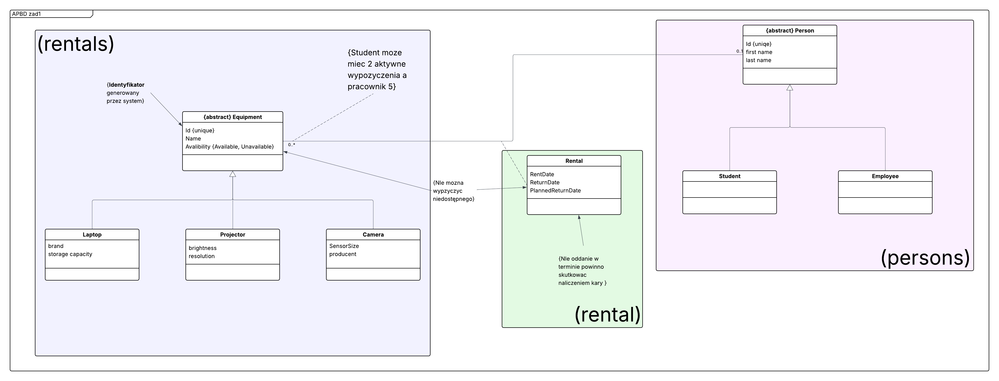

# ABPD Zad1 Aplikacja konsolowa wypożyczalni sprzętu IT
## Wstęp
Jest to prosta aplikacja konsolowa napisana w C#, .NET w wersji 10.
Aplikację uruchamiamy przez uruchomienie funkcji  Main w pliku Program.cs
Poszerzyłem podstawowe wymagania o menu tekstowe oraz funkcję zapisu i odczytywania stanu aplikacji z pliku.
> [!WARNING]
> Aplikacja tuż po starcie spróbuje wczytać dane z pliku. Jeżeli się to nie uda aplikajca wyświetli powód niepowodzenia i przejdzie po 3 sekundach automatycznie przejdzie do menu.

> [!TIP]
> Dla wygodnego użytkownia polecam rozwinąć konsole na jak największą część ekranu najlepiej jeszcze przed lub bezpośrednio po uruchomieniu.
## Decyzje projektowe - ogółem
Aplikacje dla spełnienia wymogów biznesowych zdecydowałem się podzielić na 4 główne cześci:
* persons - inaczej użytkowników
* rentals - wyposażenie do wypożyczenia
* rental - faktyczną instancję wypożyczenia
* UI - menu tekstowe

Persons i rentals są bardzo podobne, obie posiadają abstrakcyjne klasy bazowe (odpowiednio Person i Equipment) do których są wyciągnięte cześci wspóle klas szczegółowych.
Obie te klasy posiadają statyczną listę ze wszystkimi obiektami tej klasy.

Unikatowe identyfikatory w obu klasach polegają poprostu na polu int inkrementowanym przy każdym nowym obiekcie podklasy. Są one unikatowe tylko w obrębie swojej klasy (znaczy to że nie będzie studenta i employee o tym samym Id ale może być equipment i student z tym samym Id).

Rental jest klasą odpowiedzialną za każde pojedyńcze wypożyczenie posiada informacje kto, co, kiedy, do kiedy wypożyczył i kiedy powinien być planowy zwrot.

Dla wizualizacji stworzyłem schemat który zamieszczam poniżej. Jest to gdzieś miedzy schematem klas UML a zwykłą wizualizacją i tak też powinien być traktowany (bardzo nie dosłownie).

Szczegółowe informacje i moje komentarze znajdują się w odpowiednich linkach poniżej.
## Linki
[Rentals](ConsoleApp1/rentals/Readme.md)  
[Persons](ConsoleApp1/persons/Readme.md)  
[UI](ConsoleApp1/UI/Readme.md)  
[Exceptions](ConsoleApp1/Exceptions/Readme.md)  
[Database](ConsoleApp1/Database/Readme.md)  
